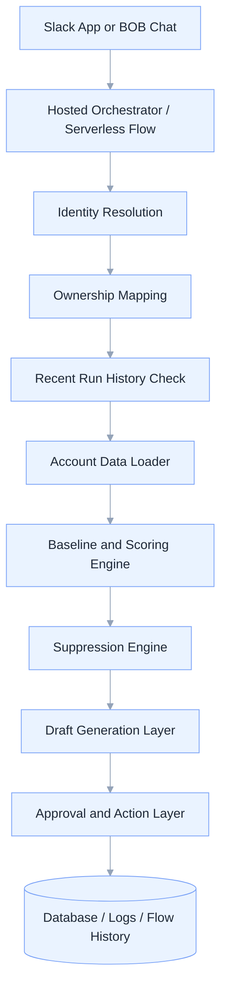
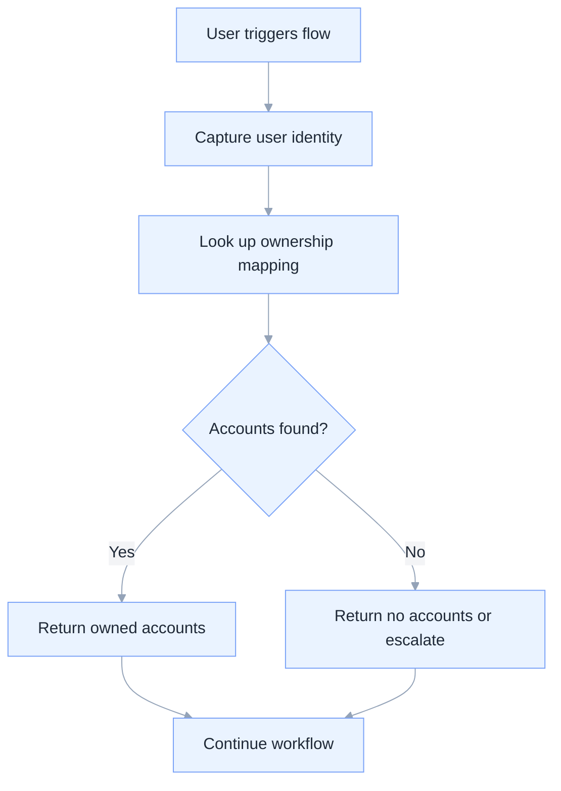
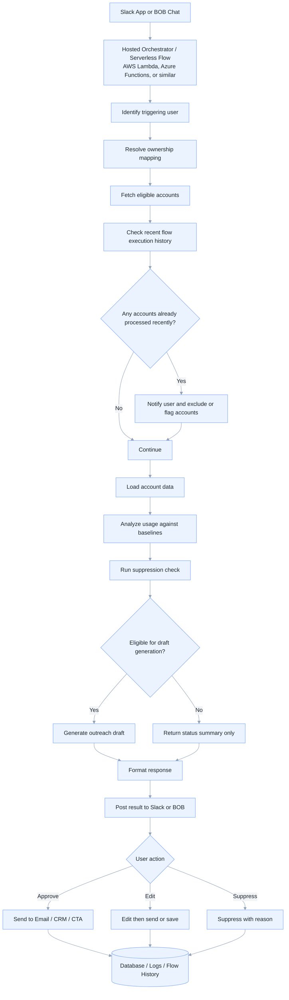

# Architecture Overview

This document describes the logical architecture for the Adoption Campaign Automation tool across demo and production environments.

## Architecture Goals

The architecture is designed to:

- support Slack or BOB-triggered adoption reviews
- identify the requesting user and scope the analysis correctly
- analyze only the relevant accounts
- prevent duplicate processing through recent-run suppression
- compare usage against configurable baselines
- generate AI-assisted outreach drafts
- keep a clear audit trail of decisions and actions

## High-Level Architecture

## Core Components

### 1. Trigger Layer

The trigger layer is the user-facing entry point.

Examples:
- Slack slash command
- Slack bot interaction
- BOB chat request
- scheduled workflow trigger

Responsibilities:
- receive the request
- capture user identity
- capture request scope such as one account, owned accounts, or all accounts

### 2. Orchestration Layer

The orchestration layer coordinates the workflow.

Recommended production options:
- AWS Lambda
- Azure Functions
- similar serverless orchestration tools

Responsibilities:
- identify the triggering user
- resolve ownership mapping
- fetch eligible accounts
- check recent flow execution history
- load account data
- invoke scoring and suppression logic
- invoke Bob or LLM draft generation
- format the response
- log the final outcome

### 3. Identity Resolution

The system should identify the user from the trigger source.

Possible identifiers:
- Slack user ID
- email address
- display name
- internal user ID

This identity is then used to determine which accounts the user is allowed to review.

### 4. Ownership Mapping

Ownership mapping determines which accounts belong to the requesting user.

### Demo Approach
For the demo, ownership can be inferred from local account metadata.

### Production Approach
For production, ownership should come from a synced source of truth such as:
- Gainsight
- Salesforce
- another operational ownership system

Recommended pattern:
- maintain a synced ownership map
- use that map at runtime
- avoid querying multiple systems live on every request unless needed

## Ownership Resolution Flow

## 5. Recent Flow Execution History

Before analyzing accounts, the system should check whether the flow already ran recently for any of them.

Purpose:
- avoid duplicate processing
- avoid repeated recommendations
- improve user trust
- support governance and auditability

Recommended fields in flow history:
- account name or account ID
- triggering user
- run timestamp
- run type
- suppression window
- final action taken

If an account was already processed within the configured suppression window, the system should:
- notify the user
- exclude or flag the account
- continue with remaining eligible accounts

## 6. Account Data Loader

The account data loader retrieves the inputs needed for analysis.

### Demo Inputs
- active users CSV
- feature usage CSV
- account metadata file
- outreach history CSV if available

### Production Inputs
- Amplitude usage data
- warehouse tables
- CRM account metadata
- CTA / outreach history
- synced ownership map

## 7. Baseline and Scoring Engine

The scoring engine compares actual usage against expected baselines.

Responsibilities:
- select the correct baseline
- compare feature usage against baseline targets
- calculate feature achievement percentages
- calculate weighted account health score
- classify account status
- detect trend signals

See [`BASELINE_SCORING.md`](BASELINE_SCORING.md) for the detailed scoring model.

## 8. Suppression Engine

The suppression engine determines whether outreach should be blocked.

Suppression checks may include:
- recent flow execution
- recent email outreach
- recent manual outreach
- open CTA
- account already healthy

If suppression applies, the system should return a summary without generating a new draft.

## 9. Draft Generation Layer

If the account is eligible, Bob or an LLM generates a draft.

Draft inputs:
- account name
- health score
- top feature gaps
- trend signal
- baseline context
- recommended next step

Draft outputs:
- subject line
- email body
- optional CTA recommendation
- explanation summary for the CSM

## 10. Approval and Action Layer

The system should keep a human in the loop.

Possible actions:
- approve
- edit
- suppress
- save for later

Final actions may be sent to:
- email platform
- CRM
- CTA system
- internal logging system

## End-to-End Workflow

## Demo Architecture

The demo architecture is intentionally lightweight.

Characteristics:
- local files instead of live APIs
- manual or semi-automated orchestration
- account metadata used for ownership mapping
- CSV-based usage analysis
- markdown or chat-based output

Benefits:
- easy to explain
- easy to demo
- low setup overhead
- good for validating workflow and scoring logic

Limitations:
- ownership data can become stale
- no real-time integrations
- limited automation depth
- not suitable as the final production architecture

## Production Architecture

The production architecture should be event-driven and integration-based.

Recommended characteristics:
- Slack or BOB trigger
- serverless orchestration
- synced ownership mapping from Gainsight or Salesforce
- usage data from Amplitude or warehouse
- suppression and flow history in a database
- LLM-based draft generation
- CRM / CTA / email integration
- centralized logging and monitoring

## Recommended Data Stores

### Ownership Mapping Store
Stores:
- user identity
- account identity
- ownership source
- last sync timestamp

### Flow History Store
Stores:
- account
- triggering user
- run timestamp
- suppression window
- final action

### Outreach History Store
Stores:
- contact date
- channel
- outreach type
- status
- CTA state

### Baseline Configuration Store
Stores:
- tier
- industry
- feature baseline values
- weights
- threshold rules

## Security and Governance Considerations

Production design should include:
- authenticated trigger source
- role-based access to account data
- audit trail for all actions
- secure storage of API credentials
- encryption for sensitive data
- clear suppression and approval controls

## Scalability Considerations

The architecture should support:
- single-account reviews
- owned-account portfolio reviews
- batch reviews across many accounts
- asynchronous processing if needed
- retry logic for external API failures

Serverless orchestration is a strong fit because:
- requests are event-driven
- workloads are intermittent
- scaling is automatic
- operational overhead is lower

## Recommended Evolution Path

1. documentation-first demo
2. local runnable prototype
3. hosted or serverless MVP
4. production integrations with real systems
5. advanced analytics and personalization

## Related Documents

- [`README.md`](README.md)
- [`BASELINE_SCORING.md`](BASELINE_SCORING.md)
- [`DEMO_DATA.md`](DEMO_DATA.md)
- [`ROADMAP.md`](ROADMAP.md)