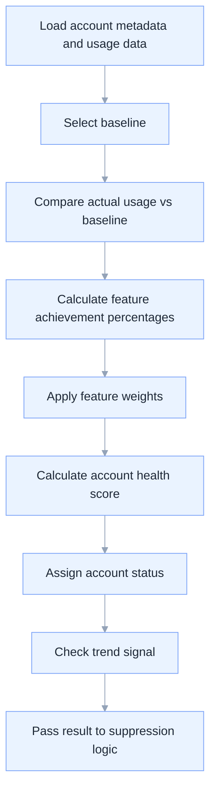

# Baseline and Scoring Overview

This document explains how the Adoption Campaign Automation tool evaluates account health using baseline targets, weighted scoring, trend analysis, and suppression rules.

## Purpose

The scoring model exists to answer three questions consistently:

1. is the account healthy or under-adopted?
2. which features are below expectation?
3. should the system recommend outreach now?

## Baseline Philosophy

Baselines represent expected adoption levels for a given account segment.

They should be:
- simple enough to explain
- consistent enough to compare across accounts
- flexible enough to evolve over time
- grounded in business expectations rather than arbitrary thresholds

For the demo, baselines are defined by:
- account tier
- industry if needed
- default fallback rules

## Baseline Selection Logic

The system should select baselines in this order:

1. account tier
2. industry
3. default baseline

If tier is missing:
- use industry baseline

If both tier and industry are missing:
- use default baseline and lower the confidence level

## Demo Baseline Matrix

### Enterprise Tier

| Feature | Monthly Baseline | Weight | Healthy Threshold |
|---|---:|---:|---:|
| Dashboards | 10 | 40% | 80% of baseline |
| Reports | 4 | 25% | 80% of baseline |
| Insights / Analytics | 4 | 20% | 80% of baseline |
| Rightsizing / Optimization | 2 | 15% | 80% of baseline |

### Mid-Market Tier

| Feature | Monthly Baseline | Weight | Healthy Threshold |
|---|---:|---:|---:|
| Dashboards | 5 | 40% | 80% of baseline |
| Reports | 2 | 25% | 80% of baseline |
| Insights / Analytics | 2 | 20% | 80% of baseline |
| Rightsizing / Optimization | 1 | 15% | 80% of baseline |

### Default Baseline

| Feature | Monthly Baseline | Weight | Healthy Threshold |
|---|---:|---:|---:|
| Dashboards | 5 | 40% | 80% of baseline |
| Reports | 2 | 25% | 80% of baseline |
| Insights / Analytics | 2 | 20% | 80% of baseline |
| Rightsizing / Optimization | 1 | 15% | 80% of baseline |

## Feature-Level Achievement

For each tracked feature, the system calculates:

`feature achievement percent = actual usage / baseline usage`

Examples:
- baseline 10, actual 8 = 80%
- baseline 4, actual 1 = 25%
- baseline 2, actual 0 = 0%

## Feature-Level Status

Each feature can be classified as:

- **Healthy**: 80% or more of baseline
- **Watchlist**: 50% to 79% of baseline
- **At Risk**: below 50% of baseline

## Weighted Account Health Score

The account-level score is a weighted combination of feature achievement percentages.

Example weighting:
- dashboards achievement × 40%
- reports achievement × 25%
- insights achievement × 20%
- optimization achievement × 15%

This creates a single score that reflects both breadth and importance of adoption.

## Account-Level Status

| Score Range | Status |
|---|---|
| 80 and above | Healthy |
| 60 to 79 | Watchlist |
| 40 to 59 | At Risk |
| Below 40 | Critical |

## Scoring Flow

## Trend Analysis

Trend analysis adds context beyond a single score.

The system should evaluate the last 3 months where available.

### Trend Labels

- **Declining**: usage drops by more than 20% month-over-month in one or more key features
- **Stable Low**: usage remains below 50% of baseline for 2 or more months
- **Recovering**: usage improves for 2 consecutive periods
- **Stable Healthy**: usage remains above 80% of baseline

### Why Trend Matters

Two accounts can have the same score but different urgency.

Examples:
- low but improving account may need lighter intervention
- low and declining account may need urgent outreach

## Suppression Rules

Even if an account is under baseline, the system should not always generate outreach.

### Standard Suppression Parameters

- suppression window days = 30
- suppress if recent email = yes
- suppress if recent manual outreach = yes
- suppress if open CTA exists = yes
- suppress if flow already ran recently = yes

### Suppression Outcomes

- **Suppressed**: no draft generated
- **Eligible**: proceed to draft generation

## Draft Eligibility Rules

A draft should be generated only if all conditions are true:

- account status is Watchlist, At Risk, or Critical
- account is below baseline in at least one tracked feature
- account is not suppressed
- enough data exists to explain the recommendation

If data is incomplete:
- return review needed instead of drafting automatically

## Confidence and Data Quality

The system should indicate confidence in the analysis.

### High Confidence
- tier available
- 3 months of usage data available
- outreach history available

### Medium Confidence
- tier missing but industry available
- only 1 to 2 months of usage data available

### Low Confidence
- missing tier and industry
- incomplete feature mapping
- no outreach history

## Example Account Evaluation

### Example: Enterprise Account

| Feature | Actual | Baseline | Achievement |
|---|---:|---:|---:|
| Dashboards | 5 | 10 | 50% |
| Reports | 3 | 4 | 75% |
| Insights | 1 | 4 | 25% |
| Optimization | 0 | 2 | 0% |

Interpretation:
- dashboards = Watchlist
- reports = Watchlist
- insights = At Risk
- optimization = At Risk

Weighted result:
- overall score falls into the At Risk range

If no outreach in last 30 days:
- generate draft

If outreach exists in last 30 days:
- suppress

## Feature Mapping Guidance

Raw exported feature names may vary. The system should map them into standard categories.

| Standard Category | Example Raw Labels |
|---|---|
| Dashboards | dashboards, dashboard views |
| Reports | reports, saved reports |
| Insights / Analytics | analytics_overview, insights |
| Rightsizing / Optimization | rightsizing, optimize, optimization |
| Cost Explorer | truecost explorer, cost explorer |

For demo simplicity, the top 4 tracked categories should drive the score.

## Recommended Review Cadence

- run account review weekly for demo purposes
- use latest full-month data where possible
- avoid mixing partial-month and full-month comparisons unless clearly labeled

## Design Principles

The scoring model should remain:

- explainable
- configurable
- segment-aware
- trend-aware
- suppression-aware
- easy to audit

## Related Documents

- [`README.md`](README.md)
- [`ARCHITECTURE.md`](ARCHITECTURE.md)
- [`DEMO_DATA.md`](DEMO_DATA.md)
- [`ROADMAP.md`](ROADMAP.md)