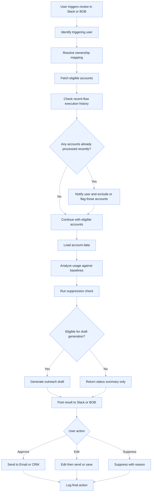
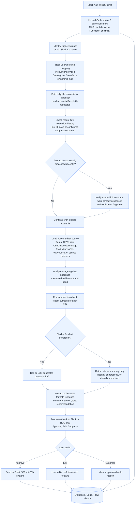

# Adoption Campaign Automation

A documentation-first project for automating customer adoption reviews using product usage data, baseline scoring, suppression logic, and AI-assisted outreach drafting.

## Overview

Adoption Campaign Automation helps Customer Success teams identify under-adopted accounts, prioritize outreach, and generate personalized follow-up drafts with human approval in the loop.

For the demo version, the workflow uses downloaded CSV exports and local account folders instead of live integrations. For the production version, the same workflow can be powered by a hosted orchestrator or serverless flow using systems such as Gainsight, Salesforce, Amplitude, Slack, and an LLM provider.

## Problem Statement

Customer Success Managers often need to answer a recurring question:

**Which accounts are under-adopting the product, which ones need outreach, and what should we say to them?**

In many organizations, this process is still manual.

A CSM or operations user typically has to:

1. identify which accounts they own
2. export or locate usage data
3. compare usage against expected baselines
4. check whether outreach already happened recently
5. determine whether the account is healthy, watchlist, at risk, or critical
6. draft a personalized email or CTA
7. log the action in a CRM or internal system

This creates several operational problems:

- too much manual effort
- inconsistent account reviews
- delayed outreach to at-risk customers
- duplicate outreach when suppression checks are missed
- poor scalability across larger portfolios
- limited auditability of why an account was flagged

## Solution

The Adoption Campaign Automation tool standardizes and automates this workflow.

It can:

- identify the user who triggered the request in Slack or BOB chat
- fetch only the accounts assigned to that user, or all accounts if explicitly requested
- check whether the flow already ran recently for those accounts
- analyze usage against predefined baselines
- classify accounts into healthy, watchlist, at risk, or critical
- apply suppression logic for recent outreach or open CTA
- generate a personalized outreach draft using Bob or an LLM
- post the result back into Slack or BOB chat for approval
- log the final action for auditability and future suppression checks

## Why This Tool Is Needed

This tool reduces repetitive manual work and helps CSMs focus on action instead of data gathering.

### Manual Process Example

For a portfolio review of 10 accounts, a CSM may spend:

| Step | Estimated Time |
|---|---:|
| Identify owned accounts | 5-10 min |
| Locate and review usage exports | 30-50 min |
| Compare usage against baselines | 20-30 min |
| Check recent outreach / CTA history | 10-20 min |
| Draft personalized outreach | 40-60 min |
| Log actions and summarize findings | 10-20 min |

**Estimated total:** 115 to 190 minutes  
**Equivalent:** roughly 2 to 3+ hours for 10 accounts

### Automated Process Example

With this tool:

| Step | Estimated Time |
|---|---:|
| Trigger review in Slack or BOB | 1 min |
| Ownership filtering and suppression checks | 1-2 min |
| Usage scoring and trend analysis | 1-3 min |
| Draft generation and response formatting | 1-3 min |
| Human approval / edit | 2-5 min |

**Estimated total:** 6 to 14 minutes depending on batch size and approvals

### Efficiency Impact

- up to **90%+ reduction** in manual review time
- faster identification of at-risk accounts
- more consistent outreach decisions
- better governance through suppression and logging
- easier scaling across larger account portfolios

## Business Process Flow

## Hosted Orchestrator / Serverless Architecture Flow

## Architecture Summary

The solution has five logical layers:

1. **Trigger Layer**
   - Slack App or BOB chat
   - user initiates review for one account, owned accounts, or all accounts

2. **Orchestration Layer**
   - hosted orchestrator or serverless flow
   - handles identity lookup, ownership filtering, suppression checks, scoring, and response formatting

3. **Data Layer**
   - demo: CSVs and local account folders
   - production: Amplitude, Gainsight, Salesforce, data warehouse, or synced datasets

4. **Decisioning Layer**
   - baseline selection
   - health scoring
   - trend analysis
   - suppression logic
   - draft eligibility

5. **Action Layer**
   - Bob or LLM draft generation
   - Slack / BOB approval workflow
   - email / CRM / CTA action
   - logging and audit trail

For a deeper architecture view, see [`ARCHITECTURE.md`](ARCHITECTURE.md).

## Demo vs Production Approach

### Demo Version

The demo version is intentionally simple and presentation-friendly.

It uses:

- local account folders
- CSV exports for active users and feature usage
- account metadata files
- optional outreach history CSVs
- baseline reference document
- manual or scripted analysis flow

This is ideal for:
- stakeholder demos
- workflow validation
- scoring logic review
- sample outreach generation

### Production Version

The production version should replace local metadata-driven logic with system-driven orchestration.

Recommended production approach:

- Slack or BOB as the trigger surface
- hosted orchestrator / serverless flow
- ownership mapping from synced Gainsight or Salesforce data
- usage data from Amplitude or warehouse
- suppression and flow history stored in a database
- Bob or LLM for draft generation
- CRM / CTA / email system for final action logging

## Deployment Recommendation Summary

### Recommended for Production

Use a **serverless orchestration model** such as:

- AWS Lambda
- Azure Functions
- or a similar serverless workflow platform

Why this is recommended:

- event-driven and well suited for Slack-triggered workflows
- lower operational overhead
- easier scaling
- cost-efficient for intermittent usage
- simpler to integrate with external APIs and logging systems

### When a Hosted Agent May Be Better

A hosted agent or hosted service may be better if:

- workflows become long-running
- orchestration becomes highly stateful
- you need persistent sessions
- you need custom runtime control or enterprise networking constraints

### Practical Recommendation

For this project:

- **demo / pilot:** local or hosted orchestrator is acceptable
- **production MVP:** serverless orchestration is the strongest recommendation

## Documentation Map

This documentation set is organized as follows:

- [`README.md`](README.md) - overview, problem statement, solution, flows, and deployment summary
- [`ARCHITECTURE.md`](ARCHITECTURE.md) - technical architecture and orchestration details
- [`BASELINE_SCORING.md`](BASELINE_SCORING.md) - baseline logic, scoring model, and suppression rules
- [`DEMO_DATA.md`](DEMO_DATA.md) - demo account structure and sample data design
- [`ROADMAP.md`](ROADMAP.md) - future enhancements and production evolution
- [`docs/deployment-guide.md`](docs/deployment-guide.md) - deployment guidance for demo and production
- [`docs/customization-guide.md`](docs/customization-guide.md) - how to adapt baselines, features, and workflows
- [`examples/sample-analysis-report.md`](examples/sample-analysis-report.md) - sample account review output
- [`examples/sample-outreach-draft.md`](examples/sample-outreach-draft.md) - sample outreach draft

## Example Use Cases

- review all accounts owned by a specific CSM
- identify accounts below baseline for dashboards, reports, analytics, or optimization
- suppress outreach if the flow already ran recently
- suppress outreach if recent email or open CTA exists
- generate a personalized draft for at-risk accounts
- provide a human approval step before any outbound action

## Current Scope

This repository is documentation-first and demo-oriented.

It is designed to help:

- explain the business problem
- communicate the workflow clearly
- document the scoring and suppression logic
- support stakeholder reviews
- provide a clean foundation for a future deployable application

## Next Steps

Recommended next phases:

1. finalize documentation and diagrams
2. publish the clean GitHub repository
3. add demo assets and sample outputs
4. build a lightweight runnable prototype
5. evolve into a hosted or serverless MVP

## License

Add a license before publishing to GitHub.  
A permissive option such as MIT is usually suitable for a documentation-first demo repository.