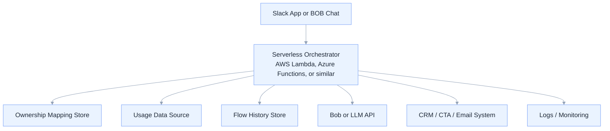

# Deployment Guide

This guide outlines how to position and deploy the Adoption Campaign Automation workflow across demo, prototype, and production stages.

## Deployment Modes

### 1. Documentation-Only Mode
Use this mode when:
- presenting the concept
- sharing architecture on GitHub
- aligning stakeholders
- reviewing workflow logic

Components:
- markdown documentation
- flow charts
- baseline logic
- demo data references

### 2. Demo Mode
Use this mode when:
- showing the workflow with sample data
- validating scoring and suppression logic
- demonstrating outreach generation

Components:
- local account folders
- CSV exports
- metadata files
- optional local scripts
- markdown outputs

### 3. Prototype Mode
Use this mode when:
- testing the workflow end to end
- generating reports automatically
- validating orchestration logic before production

Components:
- local or hosted runtime
- reusable scoring logic
- sample Slack or chat trigger
- sample logging

### 4. Production MVP Mode
Use this mode when:
- integrating with real systems
- supporting real users
- storing flow history centrally
- enforcing governance and suppression rules

Components:
- Slack App or BOB trigger
- hosted orchestrator or serverless flow
- ownership mapping source
- usage data source
- database / logs
- LLM or Bob integration
- CRM / CTA / email integration

## Recommended Production Deployment

Recommended orchestration layer:
- AWS Lambda
- Azure Functions
- or similar serverless workflow platform

Recommended supporting services:
- database for flow history and suppression
- synced ownership mapping from Gainsight or Salesforce
- usage data from Amplitude or warehouse
- secure secret management
- centralized logging and monitoring

## Why Serverless Is Recommended

Serverless is a strong fit because the workflow is:
- event-driven
- request-based
- intermittent rather than always-on
- integration-heavy
- easy to break into logical steps

Benefits:
- lower operational overhead
- easier scaling
- cost efficiency
- simpler deployment model for MVP

## Suggested Production Deployment Pattern

## Demo Deployment Pattern

For the demo, keep the setup simple.

Recommended demo components:
- local folder-based account data
- CSV exports
- baseline reference document
- manual or scripted orchestration
- markdown outputs for reports and drafts

Benefits:
- fast to set up
- easy to explain
- no dependency on live APIs
- ideal for stakeholder walkthroughs

## Production Readiness Checklist

Before production deployment, confirm:

- ownership source of truth is defined
- suppression rules are finalized
- baseline configuration is versioned
- flow history storage is available
- approval workflow is defined
- secrets are stored securely
- logging and monitoring are enabled
- retry and failure handling are designed

## Security Considerations

Production deployment should include:
- authenticated trigger source
- role-based access controls
- encrypted secrets
- audit logging
- least-privilege service permissions
- secure API integrations

## Rollout Strategy

Recommended rollout path:

1. documentation-first repo
2. demo workflow with sample data
3. local runnable prototype
4. limited production MVP with selected users
5. broader rollout with monitoring and governance

## Related Documents

- [`../README.md`](../README.md)
- [`../ARCHITECTURE.md`](../ARCHITECTURE.md)
- [`../BASELINE_SCORING.md`](../BASELINE_SCORING.md)
- [`../ROADMAP.md`](../ROADMAP.md)